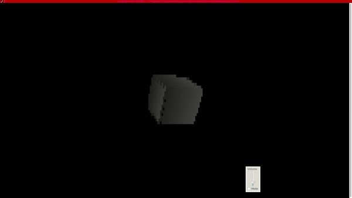

Simple console 3D renderer.

Dependencies
    - ncurses (terminal output, input handling)
    - glm (calculations)
    
    
To execute, open a terminal and set TERM=xterm-256color, then find a program and run it.

To exit press [ESC].
WASD - moving
QE - rotation around Y axis

Demo:

